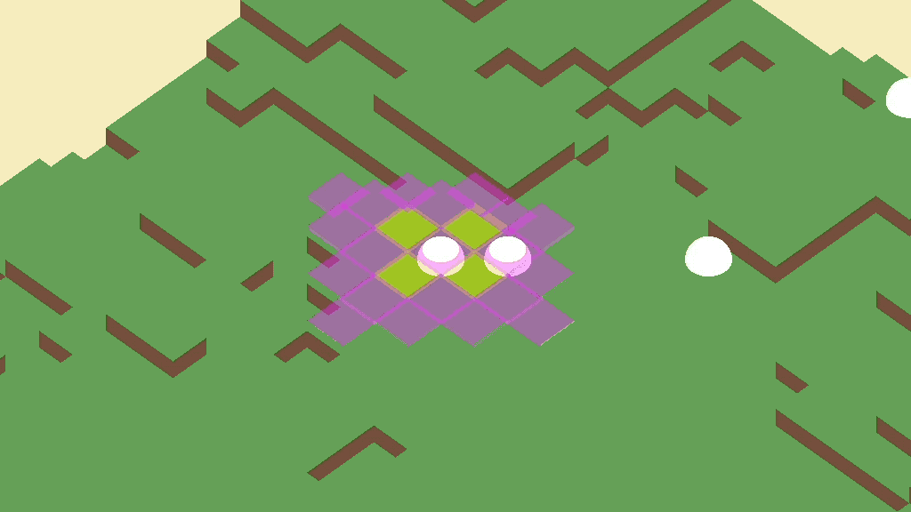

# Godot + Python Example Project

This is a simple demo of a grid tactics game (ala Tactics Ogre, Fire Emblem, etc) using the Python scripting library for Godot.

## Running

The main scene of the game is located at `python/PythonTestScene.tscn` use this to run the demo in Godot engine.

## Setup

1. Import the project into [Godot](https://godotengine.org/).

2. Install [godot-python](https://github.com/touilleMan/godot-python/).

3. Initialize Python evironment using helper scripts:
   **Option 1**: Using `Makefile`

    ```bash
    make install
    ```

    **Option 2**: Using helper scripts

    ```bash
    # setup pip environment
    PROJECT_PATH=$(pwd) python/setup_pip.sh
    # install pip packages
    PROJECT_PATH=$(pwd) python/install.sh
    ```

## Tests

Use the Makefile to run the tests.

```bash
make test
```

Tests are located in `python/test` directory.

## Notes

This was tested using Godot version `3.2.4beta4` on an ARM-based build of MacOS Big Sur and `python-script` at `v0.50.0`. No other versions of either are guaranteed to work.
